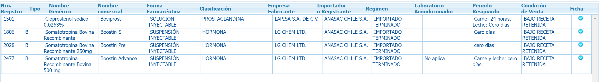

- Daily Task
	- TODO 看书
	- DONE 学习米课 [[汪晟米课]]
	- DONE 练字
- [[客户交流]]CPEW 上遇到参展的 [[Anasac]]
	- 准备资料：
		- 和Jorge的视频会议提到过：Anasac is one of Jorge's best client (Anasac had planned to register **Azamethiphos** in Chile but failed *@Wang Shuying*). Jorge has a broker that sells **mineral substances** for livestocks. Like DCP, Dicalcium Phosphorate and a lot of Vitamines. Nutrition products: Feed additive
		- 官网介绍：Anasac在农业、兽药、种子处理、卫生消杀领域都有布局。
		- 腾道进口数据：DIFLUFENICAN 吡氟草胺；Salmon Treat；异丙胺（日出有在分销）；异丙隆；咯菌腈（建新调查过？）。。。
		- 注册信息：
			- ANASAC AMBIENTAL S.A 注册抗寄生虫产品Lander，主要成分为Permethrin 24%+吡虫啉6%
			- Anasac Chile SA注册了激素类产品
				- 
			-