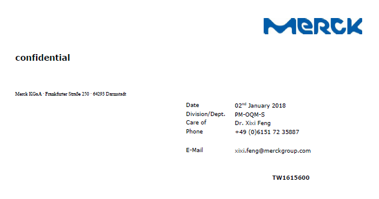
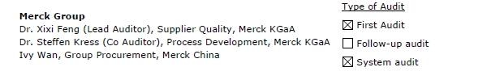
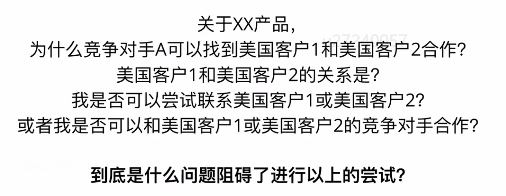

- Daily Task
	- DONE 学习米课 [[汪晟米课]]
	- DONE 打卡学习乐理知识
- 客户开发（20%）：
	- DONE 哒嗪医药客户领英添加
	- DONE 领英优化自我介绍
- 客户跟进（40%）：
	- DONE FAV索赔协议起草，发给领导确认，再给客户看
	- DONE 天津辰欣AHP资料
	- [[客户交流]] [[佛山正典]] 灭蝇剂投标失败，和谭了解更多信息：
	  collapsed:: true
		- 询问价格区间：差异肯定是有的，当时167不满意，可以推测5吨的成交价格低于167元/kg。
		- 询问竞争对手信息：合作的是兽药厂家，是否为山东厂家
		- 可能渠道：
			- 背景：
			- 正典只作为经销商（PDA确认正典有兽药GSP）
				- 正典作为经销商，直接和其他10%的兽药厂家采购，只需要考察供应商10%的资质；但是正典有自己品牌，大概率需要重新包装销售。此种换包装操作属于擦边操作。
			- 正典扮演厂家
				- 正典扮演10%制剂厂家，需要上游供应商提供50%的资质和对应的质检单。
				- 山东风舞畜牧有50%的批准文号，但没有10%的批准文号。因此，该工厂成为合规操作的关键，但同时需要其他10%工厂的配合。
- 调查工作（20%）：
	- LATER 非泼罗尼报告梳理
- 学习总结（10%）：
- [[毅冰]] 关于新人业务员日常工作的建议：20%用于开发客户（不管是新客户还是老客户），40%跟进客户，20%调查和了解各类信息，10%学习专业技能，10%提高水平和沟通谈判能力。
- 2017年，默克来药业审计[[哒嗪]]，按要求整改后没通过，当时的业务员是张楠。2017-12来审计。
  collapsed:: true
	- 
	- 
	-
- [[LinkedIn]] [[毅冰]]：
  collapsed:: true
	- 要从客户的角度去思考，3W原则：Who, Why, What
		- 这是谁？
		- 为什么要关注他？
		- 关注他可以带来什么？
	- 构思About部门的四个内容模块
		- 介绍自己，尤其要突出擅长的技能。让客户通过一两句话对你有直观感知，知道这个家伙是干嘛的。
			- Personal Characteristic
				- Talented in negotiating a better price for our customer, thanks to deep investigations into each product.
				- Familiar with factory audit for GMP and ISO9001, backed by a professional quality team in our factory.
				- Well managed in timely delivery, always with a Plan B. During lock down of Shanghai Port, we act fast with backup solutions and received many favorable comments from our customers.
	- 工作描述
		- Manufacturing and trading pharmaceutical drugs and intermediates. Fly killer, fungicides and nutritional products.
		- Competitive in Bromine related products, based on distributing  right for Bromine.
		- Factory direct supplied products including 3,6-Dichloropyridazine, 2,6-Dichloropyrazine, Azamethiphos, etc.
		- Hope to be in contact with you.
		- 用内容来具体量化，突出取得的成果，尽量用数字来说明，而不是空口白话和自吹自擂。
		- 感性地谈谈自己地一些经历，人生中的高光时刻，或者成长过程中给自己带来力量和变化的一段插曲，国际友人特别喜欢这些。
		- 专业化展示自己的产品或服务，用专业收尾，给人可信赖和靠谱的感觉。
	-
- [[汪晟米课]]
  collapsed:: true
	- 发掘/培养你的优势，然后狠狠发挥它。如果英语口语还不错，就努力练口语。如果对某个市场很了解，和客户聊天就可以有意的引导，展示自己的专业。
	- Know what an asset is, acquire them and become rich.
	- 对问题的解构：
		- 
		-
-
-