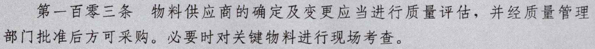

- [[营销中心例会]]
	- 客户拜访安排：
		- [[吴赣]]计划本周五拜访：
			- DONE 原材料成本核算、单耗了解，尝试询问贵妃姐
	- [[天津鸿升]]酸化剂建议：从甲酸钙贸易做起（含甲酸钙饲料的市场有万吨级别）；如果价格有优势，后期考虑工厂生产单一酸化剂（仅含甲酸钙）。
		- DONE 问秦哥甲酸钙的采购来源：江西高信前沿科技有限公司
		- 酸化剂气味来源推测：原料或是有其他杂质
		- LATER 甲酸钙贸易做起
		  :LOGBOOK:
		  CLOCK: [2022-08-23 Tue 17:28:14]--[2022-08-23 Tue 17:28:15] =>  00:00:01
		  CLOCK: [2022-08-23 Tue 17:28:16]--[2022-08-23 Tue 17:28:16] =>  00:00:00
		  CLOCK: [2022-08-23 Tue 17:28:16]--[2022-08-23 Tue 17:28:17] =>  00:00:01
		  CLOCK: [2022-08-23 Tue 17:28:17]--[2022-08-23 Tue 17:28:17] =>  00:00:00
		  CLOCK: [2022-08-23 Tue 17:28:18]--[2022-08-23 Tue 17:28:18] =>  00:00:00
		  :END:
	- [[DCPD]]药康相关业务讨论
		- [[CURIA]] 和[[Evonik]]都采购 [[DCPD]] ，终端推测情况如下：
			- 两家公司都是采购 [[DCPD]] 为MGL生产原料： [[Resmetirom]] 。
			- 预测明年放量，Curia的价格低、采购量预测较大：几十吨~100吨。赢创的价格高、采购量预测仅6吨。医药公司要求其原材料至少要有两家供应商，但是有侧重。从目前来看，Curia是MGL的主要原料供应商，这也可以推测为赢创价格高依然可以做的原因之一。
			- [[CURIA]]自己工厂也有生产[[DCPD]]的能力，但是应该存在工艺或成本限制。
		- [[CURIA]]的采购风格：本土化采购，由中国天津的Jason采购 [[DCPD]] ，但是客户不负责任何运输。对于此后[[DCPD]]出货的要求提高，所以成本整体会高一些：
			- 2-8度保证做到。
			- 总杂志控制在0.4%以下。
			- DONE [#A] 报价：按照20尺柜和40尺柜去分开报价。
			- DONE 确认常用船公司的集装箱尺寸
		- 韩国东邦-扬州一洋制药
			- DONE [#A] 由我尝试和国内的一洋制药联系，希望可以周五一起拜访。
			- DONE [#A] 了解中国医药制剂的审计工作，先询问贵妃姐
				- 购买原料药，一般是审计原料药生产厂家，原料药上游中间体没有规定，看制剂厂家需要。Curia 我们也是第一次碰到，他们的制剂公司对我们进行审计。
				- 原料药生产用关键物料，一般是由原料药生产厂家去进行评估。 
				- 供应商评估是有多种方式，看公司规定，可以是调查问卷，或者现场审计等。
				- DONE 联系 [[韩国东邦]] 和 [[一洋制药]] 都没有对我们进行过审计，但是据贵妃姐记忆是填写过问卷的。
					- 给东邦供货，很久不拿货了，担心对这个药物会有影响。我们公司这个药物作为关键的一环，觉得有必要联系下您这边。
					- 今年放量，希望拜访，探讨问题和合作；领导~~
					- 可安排午饭后，1-2点
					- 工厂位置确认
- 订单跟进：
	- DONE BASF的灭蝇剂联系 李鑫
		- 介绍联系缘由，戴燕飞 介绍，灭蝇剂样品安排2kg，给了他联系方式。我是负责灭蝇剂销售和技术支持，可以进行技术交流，反馈给工厂。上海浦东新区江心沙路300号 巴斯夫中国有限公司 李鑫 18016386606
		- 询问清楚样品要求：加微信或qq、寄送地址、寄出灭蝇剂使用说明书
- 业务开拓：
	- 联系[[Anasac]]的Jorge，先和领导确认说辞
	- DONE 处理吡嗪新询盘：海品信。
		- 和开沅确认库存
- 市场调查：
	- 非泼罗尼：出口数据整理