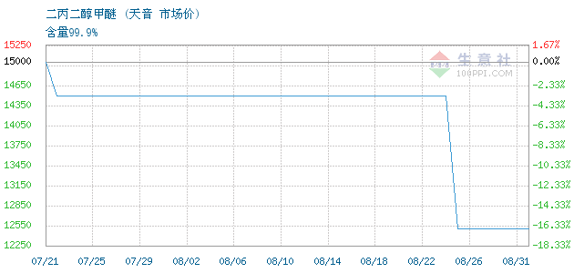

- [[吴赣]] ：
	- DONE 吡嗪业务跟踪：暂时还没有讨论过价格
	- DONE 联系许总，在准备出差资料、南美市场信息。有什么资料，联系当地客户；报价FOB CIF 9月的
- [[FAV]]
  collapsed:: true
	- [[DPM]] ：
		- DONE 询问Jorge进展情况
		- DONE DPM价格行情了解（太难了，暂缓叭，大概是处于偏弱行情）
		  :LOGBOOK:
		  CLOCK: [2022-09-01 Thu 15:57:04]--[2022-09-01 Thu 15:57:05] =>  00:00:01
		  :END:
			- 
	- [[溴硝醇]]：
		- DONE 邮件告知9月中旬触底 建议年底走掉，价格非常competitive
- DONE CentroVet采购价格分析表格
- [[阿嗪米特]]业务
	- DONE 了解三方协议书写：大致内容构想-药业提供哒嗪，并保证相应产品的销售；博雅欣和保证几年内不直接与一洋制药合作（竞业协议）
- 联系 [[默克]] 的万晓晨：
	- 介绍日出药业，做哒嗪。之前4年前来我们厂里做过审计的。
	- 根据贵妃姐之前给的信息：默克来我们厂里审计过一次，也按要求整改了，但是后续就没有进展了，因为是客户对我们的设备不满意。
	- 客户反馈：对日出有印象，对哒嗪产品是否使用印象不深。特泊替尼确实是他们的产品。关于审计，客户对我们印象不错，曾希望和我们工厂直接合作，但是我们表示只能和经销商合作。据客户称，经销商的表现和我们的差距很大，产品批次号都对不上。
	- DONE 联系贵妃姐，请她先梳理默克审计的历史
- DONE 完善吴赣出差报告
-