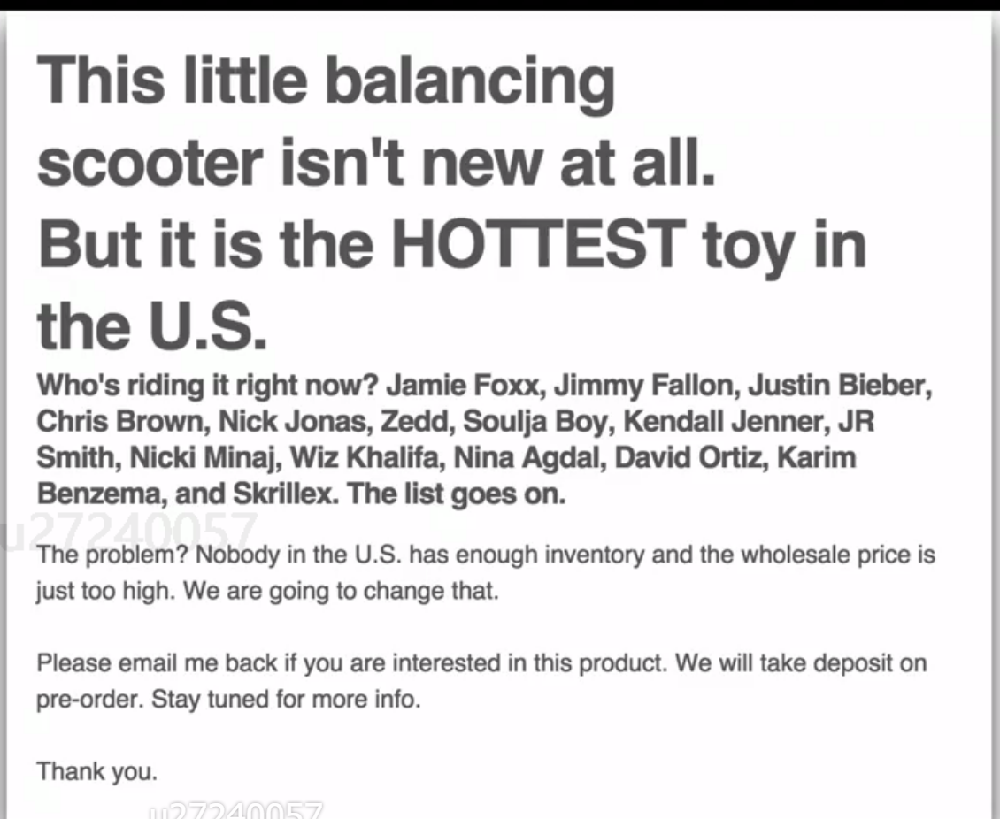

- 20% Developing:
	- [[天津方度]] ：交流酸化剂和甲基50
- 40% Follow up:
	- [[上海再启]]：2kg吡嗪，走合同流程、收款、发货细节对接
	- [[Centrovet]]: 1kg Azasure样品发货跟踪
	- [[FAV]]: 和Jorge交流，溴硝醇进口要推迟到12月去了
- 20% Investigation:
	- DONE 更新苏格兰渔场的三文药使用数据
	- DONE 查甲基进出口数据
- 10% Negotiation and other skills:
	- [[汪晟米课]]
	  collapsed:: true
		- 3.2.1 0->1000万的案例：
			- 发现趋势后，需要进行验证：Google trend; Google Adwords; Google global market finder
			- 从现有客人中获得反馈：
			  collapsed:: true
				- 
			-
- [[random thought]]
	- 开拓灭蝇剂客户，搭配1% 小包装3-5g；桶装
	- [[溴硝醇]] 新想法，把工厂对于溴素的了解和优势，日出每年处理多少溴素，行业占比多少，分享给客户
	- [[吡虫啉]] 的市场调查，可否询问工厂意见？对于虱螨脲、吡虫啉、非泼罗尼的兴趣？
	- 注册Twitter, FB, Ins
- 溴甲烷出口：
	- 精力分配：20,40,20,10,10
	- 溴甲烷接受的重要前提：名正言顺；系统学习溴甲烷出口和溴甲烷价格、单证，尽量获得主动权，我接受的单子，客户我来谈，而不是让我跟单。谁都可以来职责一句，就是销售岗位。如果名正言顺，我愿意接受。
	- 老客户接受的一些担忧：同事关系？如果我要积极改善，可能会比较激进，对单证的要求也会更高(单证准确性，减少打回次数；可以独立解决问题；我没有立场这样去要求助理)，对工厂同事也会问个不停，不希望大家觉得我多管闲事。日出的高度包容的文化，我希望可以放手去做。我也意识到自己的风格，有时候比较强势，和笑笑姐不太一样。
	- SOP的完善需要业务员的参与。我希望促进这个工作。
	- 出口需要专门的人去做，和内贸的工作方式也不一样。希望可以多个人一起做药业的内贸，慢慢把精力侧重到出口上去。
	- 开拓需要一点空余时间，不然解决问题等等，脑子会死机。
	- 之所以觉得精力不够，也是觉得自己在药业这边，确实有些疲于应付。思维导图帮助我构思了板块。另外我觉得也可以帮助分布市场。主要的开拓精力放在动保板块的出口上。
	- 溴硝醇开拓的新想法：溴素宣传，我们在溴产业链上的优势
	- 青岛展会准备
-